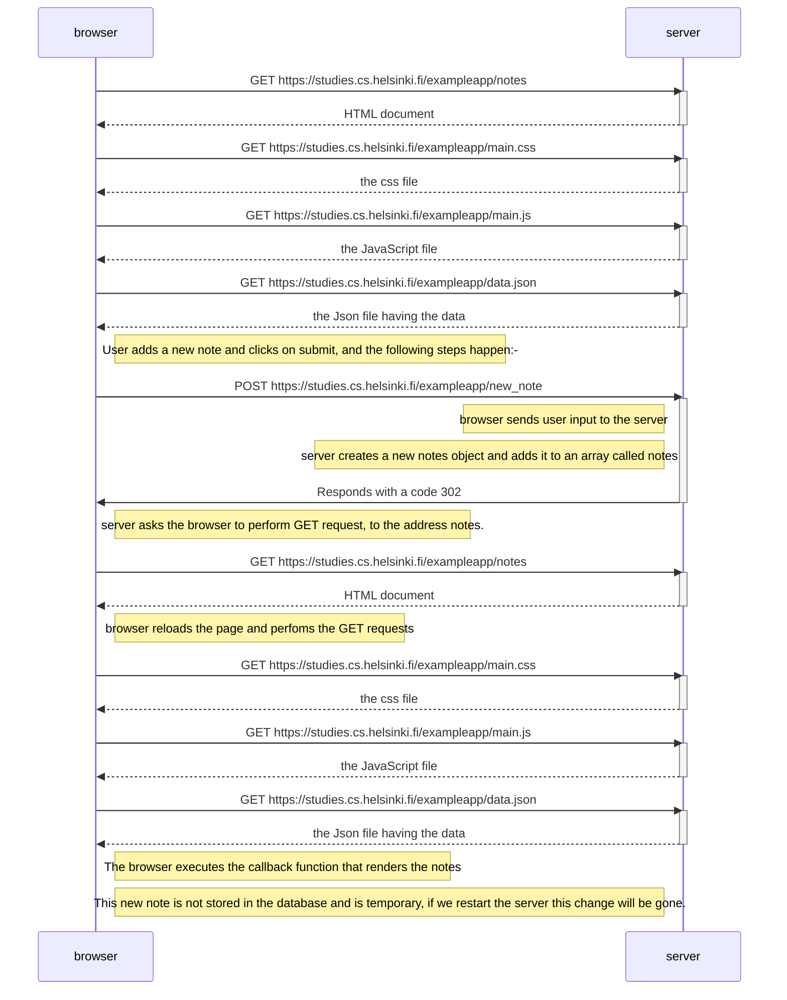

```mermaid
sequenceDiagram
    participant browser
    participant server

browser->>server: GET https://studies.cs.helsinki.fi/exampleapp/notes
activate server
server-->>browser: HTML document
deactivate server

browser->>server: GET https://studies.cs.helsinki.fi/exampleapp/main.css
activate server
server-->>browser: the css file
deactivate server

browser->>server: GET https://studies.cs.helsinki.fi/exampleapp/main.js
activate server
server-->>browser: the JavaScript file
deactivate server

browser->>server: GET https://studies.cs.helsinki.fi/exampleapp/data.json
activate server
server-->>browser: the Json file having the data
deactivate server


Note right of browser: User adds a new note and clicks on submit, and the following steps happen:-

browser->>server: POST https://studies.cs.helsinki.fi/exampleapp/new_note

activate server

Note left of server: browser sends user input to the server

Note left of server: server creates a new notes object and adds it to an array called notes

 
server->>browser: Responds with a code 302
deactivate server

Note right of browser: server asks the browser to perform GET request, to the address notes.

browser->>server: GET https://studies.cs.helsinki.fi/exampleapp/notes
activate server
server-->>browser: HTML document
deactivate server

Note right of browser: browser reloads the page and perfoms the GET requests

browser->>server: GET https://studies.cs.helsinki.fi/exampleapp/main.css
activate server
server-->>browser: the css file
deactivate server

browser->>server: GET https://studies.cs.helsinki.fi/exampleapp/main.js
activate server
server-->>browser: the JavaScript file
deactivate server

browser->>server: GET https://studies.cs.helsinki.fi/exampleapp/data.json
activate server
server-->>browser: the Json file having the data
deactivate server

Note right of browser: The browser executes the callback function that renders the notes

Note right of browser: This new note is not stored in the database and is temporary, if we restart the server this change will be gone.
```